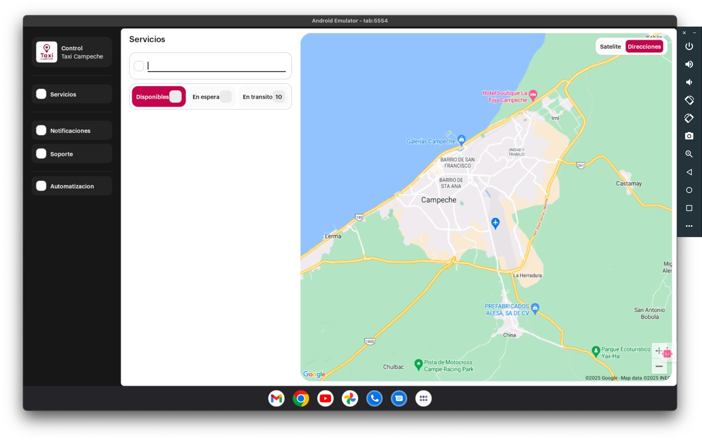

# TaxiAAtics
Se requiere .NET MAUI instalado para poder compilar y ejecutar
Requisitos minimos
|-------------------------|
|Windows 10.0.19041.0|
|Android 8.1 para arriba|
|8GB RAM|
|Quad-Core 2.1Ghz|
|Ejecutar como unico proceso visible|

> [!NOTE]
> La aplicacion esta hecha solo para ejecutarse en plataformas compatibles con Windows 10 u 11.
> Por el momento falta la compilacion en Windows, solo se puede ejecutar en emulador de android

> [!TIP]
> Se ha actualizado la plataforma a la ultima version de SDK Windows, se recomienda actualizar para poder compilar.

> [!IMPORTANT]
> Falta el panel de soporte y chat para ambas plataformas moviles

> [!WARNING]
> Pueden intentar compilarlo en Windows pero hay que modificar el archivo del proyecto de visual studio para que pueda ser cargado desde el VS de Windows, ya que las direcciones de asignacion de los directorios son diferentes en MAC

> [!CAUTION]
> La plataforma es estable pero por cualquier situacion o error de procesamiento se puede ver en el apartado de automatizacion y en el registro de abajo.
